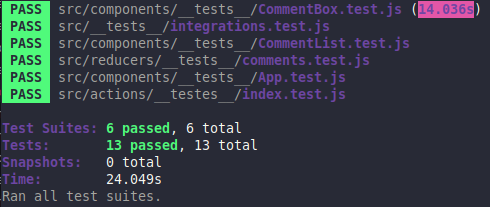

<h1 align="center">:bar_chart: Tests in React :bar_chart:</h1>
<h4 align="center">
   
</h4>

  <a href="#wrench-built-with">Built With</a>&nbsp;&nbsp;&nbsp;|&nbsp;&nbsp;&nbsp;
  <a href="#page_facing_up-about">About</a>&nbsp;&nbsp;&nbsp;|&nbsp;&nbsp;&nbsp;
  <a href="#-how-to-use">How to Use</a>&nbsp;&nbsp;&nbsp;|&nbsp;&nbsp;&nbsp;
  <a href="#bar_chart-how-to-test">How to Use</a>&nbsp;&nbsp;&nbsp;|&nbsp;&nbsp;&nbsp;
  <a href="#-how-to-contribute">How to Contribute</a>&nbsp;&nbsp;&nbsp;|&nbsp;&nbsp;&nbsp;
  <a href="#pencil-author">Author</a>

## :wrench: Built With

- [React](https://reactjs.org);
- [Create React App](https://create-react-app.dev/);
- [Jest](https://jestjs.io/);
- [Axios](https://github.com/axios/axios);
- [Moxios](https://github.com/axios/moxios);
- [Enzyme](https://enzymejs.github.io/enzyme/);
- [Redux](https://redux.js.org/).

## :page_facing_up: About

This is a simple project made to understante how to test React Applications. The App consists in and text area so the user can type in a comment, a button to add the comment to a list of comments and a button to add comment from JSON Placeholder API. The comments will be displayed bellow the buttons.

## 💻 How to Use

- Clone the project: `git clone https://github.com/Lukazovic/Advanced-React-and-Redux.git`;
- Go to the project folder: `cd Advanced-React-and-Redux`;
- Go to the testing folder: `cd testing`;
- Download the dependencies: `npm install`;
- Start the application: `npm start`.

It will open a browser page (if it doesn't, go to [http://localhost:3000](http://localhost:3000/)).

## :bar_chart: How to Test

**Observation: If you already done the [How to Use](#-how-to-use) part, skip to the last step**

- Clone the project: `git clone https://github.com/Lukazovic/Advanced-React-and-Redux.git`;
- Go to the project folder: `cd Advanced-React-and-Redux`;
- Go to the testing folder: `cd testing`;
- Download the dependencies: `npm install`;
- Run the tests: `npm test`.

Then you may see the tests running like in the image below:

## 🤔 How to Contribute

- Fork this repository;
- Create your branch with your feature: `git checkout -b my-feature`;
- Commit your feature: `git commit -m 'feat: My new feature'`;
- Push to your branch: `git push origin my-feature`.

Then merge your pull request, you can now delete your branch.

## :pencil: Author

<table>
  <tr>
    <td align="center"><a href="https://github.com/Lukazovic"> <b>Lucas Vieira</b></a> </td>
  <tr>
</table>
